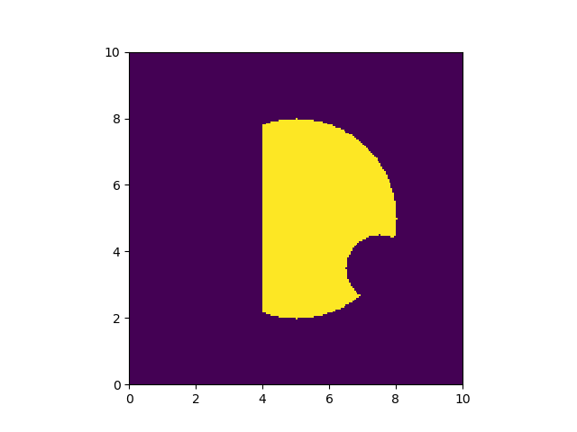

- [Retour aux exercices de programmation fonctionnelle](./td_functional.md)

- [Accès aux solutions](./td_characteristic.solutions.md)

Cette page contient des exercices mettant en valeur les fonctions
comme capables de représenter des données. L'exemple mis en place ici
est celui des [fonctions
caractéristiques](https://fr.wikipedia.org/wiki/Fonction_caract%C3%A9ristique_(th%C3%A9orie_des_ensembles)),
et est décliné en deux parties, la première permettant de représenter
des ensembles de points du plan, la seconde portant sur une
application de gestion de listes de lectures de fichiers musicaux.

### 1ère partie : les fonctions caractéristiques

Soit $E$ un ensemble (de points du plan, de fichiers, d'espèces
animales &hellip;). Une fonction caractéristique est simplement une
fonction qui prend un paramètre $x$, et répond `True` si $x \in E$ et
`False` sinon. Par exemple, la fonction suivante représente l'ensemble
contenant tout&nbsp;:

```python
def set_all(x):
	return True
```

Il s'agit d'un exemple simple de **représentation des données par des
fonctions**. Ici, la donnée, i.e l'ensemble, est identifié à sa
fonction caractéristique. Avec cet exemple, il est facile d'écrire en
Python la fonction représentant l'ensemble vide. Noter que l'on peut
restreindre l'usage de cette fonction à un ensemble particulier. Par
exemple, si on considère que $x$ est restreint au points du plan,
alors les ensembles que l'on va représenter seront des ensembles de
points du plan.

Écrire la fonction représentant le singleton $x$ est déjà plus
compliqué, puisque l'on désire une fonction qui prend en paramètre $x$
et renvoie une fonction caractéristique. Compléter le code
suivant&nbsp;:

```python
def set_single(x):
	return lambda y: (?? == ??)
```

Écrire une fonction qui prend un ensemble, et renvoie son
complémentaire. Écrire une fonction qui prend deux ensembles, et
renvoie son intersection, et une autre pour son union. Écrire une
fonction qui prend un ensemble $E$ et un paramètre $x$, et renvoie
l'ensemble $E \cup \\{x\\}$.

### 2ème partie : les ensembles de points du plan

Considérons la possibilité de dessiner des ensembles de points du
plan, avec la bibliothèque `matplotlib`. Dans les exemples qui
suivent, les points du plan sont des paires $(x,y)$. Par exemple, la
fonction suivante permet de produire un dessin à partir d'un
ensemble&nbsp;:

```python
def set_display_2d_generic(c1, c2, n, s):
    """ Draw a set s with matplotlib inside a window
        c1 is the lower left point
        c2 is the upper right point
        n is the number of divisions """
    h1 = (c2[0] - c1[0]) / n
    h2 = (c2[1] - c1[1]) / n
    m = np.zeros((n,n))
    for i in range(n):
        for j in range(n):
            m[i,j] = 1 if s((c1[1] + j * h2,
                             c2[0] - i * h1)) else 0
    mp.imshow(m,extent=[c1[0],c2[0],c1[1],c2[1]])
    mp.show()

def set_display_2d(s):
    set_display_2d_generic((0,0), (10,10), 200, s)
```

Les ensembles dessinés à l'aide de `set_display_2d` sont affichés dans
le carré d'extrémités $(0,0)$ et $(10,10)$.



Écrire une fonction de distance euclidienne entre les points définis
précédemment. Écrire la fonction caractéristique d'un disque centré
sur un point $c$ de rayon $r$. Écrire la fonction d'un rectangle
défini par ses deux extrémités $(gauche,bas)$ et $(droite,
haut)$. Dessiner un [Pac-Man](https://fr.wikipedia.org/wiki/Pac-Man).

### 3ème partie : les listes de lectures

Telles quelles, les fonctions caractéristiques gardent un parfum
"mathématique". Une application des ensembles de points consiste à
manipuler des ensembles de fichiers (ici musicaux) répondant à un
certain nombre de critères.

```python
songs = [ \
{ "title": "Walking on Broken Glass", "artist": "Annie Lennox", "album": "Diva", "track": 2, "genre": "pop rock" },
{ "title": "Roar", "artist": "Katy Perry", "album": "PRISM", "track": 1, "genre": "power pop" },
{ "title": "Don't Wanna Fight", "artist": "Alabama Shakes", "album": "Sound & Color", "track": 2, "genre": "blues rock" },
{ "title": "Grace Kelly", "artist": "Mika", "album": "Life in Cartoon Motion", "track": 1, "genre": "glam rock" },
{ "title": "Don't Stop Me Now", "artist": "Queen", "album": "Jazz", "track": 6, "genre": "pop rock" },
{ "title": "Black Pearls", "artist": "Apollo Brown", "album": "Clouds", "track": 7, "genre": "hip hop underground" },
]
```

(le choix des morceaux dans cette liste a été aimablement fourni par
une playlist aléatoire d'un site de musique en ligne, dans des
conditions d'exercice, on pourrait demander à chaque élève de produire
une musique, et les mettre ensemble)

Écrire une requête représentant l'ensemble des morceaux dont le genre
contient la chaîne `"rock"`. Écrire une requête représentant
l'ensemble des morceaux dont le titre débute par `"Don't"`.

Écrire une fonction prenant une requête, et générant une liste de
lecture de morceaux répondant à cette requête.
